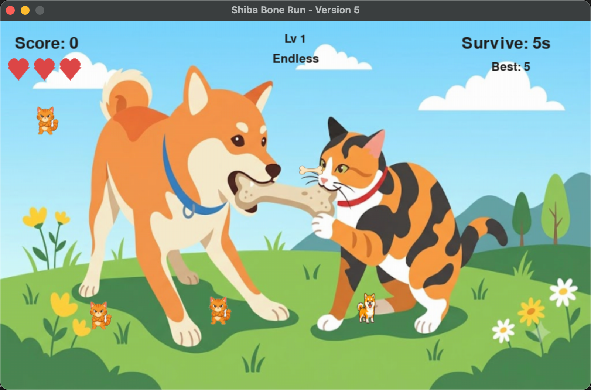

# Shiba Bone Run

A cute 2D arcade game built with Python and Pygame.

Control a Shiba Inu, collect bones, avoid cats, pick up hearts, and try to beat your high score.



## Features

- 2D arcade-style gameplay
- Time Attack mode
- Endless mode
- Moving cat enemies
- Normal bones and golden bones
- Heart pickups for healing
- Increasing difficulty over time
- High score saving with `scores.json`
- Custom image and sound asset support
- Transparent PNG asset workflow
- Built with Python and Pygame

## Game Modes

### Time Attack

You have 60 seconds to collect as many bones as possible.

### Endless

There is no timer. Survive as long as possible while the difficulty increases over time.

In Endless mode, the final score includes a survival bonus.

## Controls

| Action             | Key               |
| ------------------ | ----------------- |
| Move               | WASD / Arrow Keys |
| Pause / Resume     | P                 |
| Select Time Attack | 1                 |
| Select Endless     | 2                 |
| Restart            | R                 |
| Return to Menu     | Space             |
| Quit               | ESC               |

## Gameplay

The player controls a Shiba Inu inside a 2D arena.

The goal is to collect bones while avoiding moving cats.

| Item                 | Effect          |
| -------------------- | --------------- |
| Normal Bone          | +1 score        |
| Golden Bone          | +3 score        |
| Heart                | Restore 1 heart |
| Heart at full health | +2 score        |

The game becomes harder over time as cats move faster and more enemies appear.

## Project Structure

```text
shiba-bone-run/
├── main.py
├── make_transparent.py
├── requirements.txt
├── README.md
├── scores.json
└── assets/
    ├── images/
    │   ├── background.png
    │   ├── shiba_1.png
    │   ├── shiba_2.png
    │   ├── cat.png
    │   ├── bone.png
    │   ├── golden_bone.png
    │   └── heart.png
    ├── images_transparent/
    │   ├── background.png
    │   ├── shiba_1.png
    │   ├── shiba_2.png
    │   ├── cat.png
    │   ├── bone.png
    │   ├── golden_bone.png
    │   └── heart.png
    ├── screenshots/
    │   └── gameplay.png
    └── sounds/
        ├── collect.wav
        ├── gold.wav
        ├── hit.wav
        ├── heal.wav
        ├── level_up.wav
        ├── game_over.wav
        └── bgm.mp3
```

## Requirements

- Python 3.10+
- Pygame
- Pillow

## Installation

Clone the repository:

```bash
git clone https://github.com/ballkinguniverse/shiba-bone-run.git
cd shiba-bone-run
```

Create and activate a virtual environment:

```bash
python3 -m venv .venv
source .venv/bin/activate
```

Install dependencies:

```bash
python -m pip install --upgrade pip
python -m pip install -r requirements.txt
```

Run the game:

```bash
python main.py
```

## Transparent Image Processing

If your image assets have white backgrounds, run:

```bash
python make_transparent.py
```

This script reads images from:

```text
assets/images/
```

and outputs transparent PNG files to:

```text
assets/images_transparent/
```

The game automatically prefers `assets/images_transparent/` if it exists.

## Building for Windows

To build a Windows `.exe`, run PyInstaller on a Windows machine:

```powershell
python -m pip install pyinstaller
pyinstaller --onefile --windowed --name "Shiba Bone Run" --add-data "assets;assets" main.py
```

The executable will be created in:

```text
dist/Shiba Bone Run.exe
```

## Building for macOS

To build a macOS `.app`, run PyInstaller on macOS:

```bash
python -m pip install pyinstaller
pyinstaller --windowed --name "Shiba Bone Run" --add-data "assets:assets" main.py
```

The app will be created in:

```text
dist/Shiba Bone Run.app
```

## Notes

- `scores.json` stores local high scores and is not required for the game to run.
- If image or sound files are missing, the game uses fallback drawings and generated sound effects.
- For best visual results, use transparent PNG images for characters and items.
- Third-party image, music, and sound assets should be credited according to their licenses.

## License

This project is for learning and portfolio purposes.

If you use third-party images, music, or sound effects, make sure to check their licenses and add proper credits.
EOF